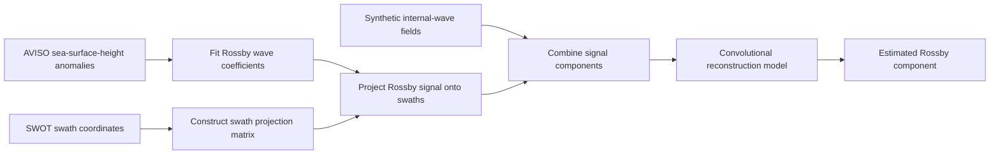

# Ocean Satellite Wave Separation

Research notebooks for separating Rossby-wave structure from synthetic internal-wave
contamination in sea-surface-height data sampled along SWOT satellite swaths.
The workflow combines a physical wave representation, spatial projection and
TensorFlow/Keras reconstruction models.

Research context: an international summer research internship at Scripps Institution
of Oceanography, UC San Diego, with Prof. Sarah Gille, as described in the supplied
CV. The source collection contains preprocessing notebooks, an existing Rossby-wave
helper module, several model experiments and local NetCDF/HDF5 artifacts.

## Approach



The target arrays contain the Rossby component; inputs combine Rossby and synthetic
internal-wave signals. This is a controlled reconstruction experiment rather than
a claim that ground-truth wave separation is available for all observed SWOT data.
Although some original file names say `1D`, the corresponding networks use `Conv2D`
over time and flattened swath-point axes.

## What is included

- Eight staged training/testing preprocessing notebooks.
- A primary model notebook with matching 20-day swath data structure.
- Alternative spatial, dense-decoder, tanh-decoder and adversarial experiments.
- The original numerical helper, portable file-access utilities, and lightweight checks.
- Dataset and checkpoint manifests with SHA-256 hashes, without committing large data.

The canonical archived datasets contain **117 training sets and 59 testing sets**,
each with **277 swath points over 20 sampled days**. These shapes were checked
directly in the NetCDF files. No unverified accuracy or denoising-performance
percentage is claimed.

## Start here

For the model workflow, restore the two `new2_ssh_*_data.nc` files listed in
[data/artifact-manifest.json](data/artifact-manifest.json), install the model
dependencies, then open
[05_train_swath_autoencoder.ipynb](notebooks/modeling/05_train_swath_autoencoder.ipynb).
Review the epoch count and set `ALLOW_TRAINING = True` only when ready to train.

```bash
python -m pip install -r requirements-models.txt
jupyter lab
```

Generated files go to `artifacts/`; inputs remain in `data/`. Existing generated
files are protected against silent overwrite. Model training has not been rerun
during preparation. The original checkpoints record Keras 2.6.0; exact compatibility
with newer TensorFlow/Keras releases has not been established.

Full raw-data reproduction remains incomplete because several upstream files and
the `internal_waves` module were absent. The available AVISO NetCDF has a different
layout and time span from the missing MATLAB input and is not substituted blindly.
See [reproduction instructions](docs/reproduction.md) for the execution order and
missing inputs, and [limitations](docs/limitations.md) for evaluation details.

## Validation

```bash
python scripts/check_repository.py
```

The lightweight checker compiles Python cells, validates notebook schemas when
`nbformat` is installed, checks portable path protection and performs a small
numerical inversion check when NumPy is installed. It does not execute training,
download datasets or rebuild the physical preprocessing pipeline.

## Attribution and data rights

The supplied notebooks do not fully resolve per-file authorship or include a
project license. Original scientific helpers are retained with provenance and
no assertion of sole authorship. See [NOTICE.md](NOTICE.md). Satellite products,
derived datasets and checkpoint files remain local until their redistribution
status is established.
