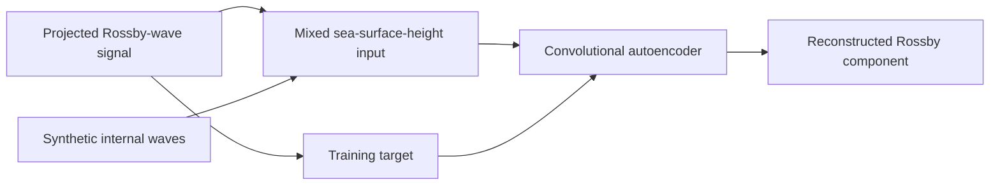

# Deep Learning for Source Separation in SWOT Satellite Altimetry

Denoising autoencoder experiments for recovering Rossby-wave structure from
sea-surface-height fields contaminated by synthetic internal waves. The research
combines physical wave modeling, projection onto SWOT satellite swaths, and
convolutional reconstruction in flattened and spatial representations.

Developed during the International Summer Research Program at Scripps Institution
of Oceanography, UC San Diego, with Prof. Sarah Gille (July-August 2024).

**Implementation:** [Main model notebook](notebooks/modeling/05_train_swath_autoencoder.ipynb)
· [Setup](docs/reproduction.md) · [Data manifest](data/artifact-manifest.json)

**Tools:** TensorFlow/Keras, NumPy, SciPy, xarray, NetCDF, Matplotlib.

## Workflow



The canonical derived datasets contain **117 training sets and 59 validation
sets**, each with **277 swath points over 20 sampled days**. The historical files
name the validation split `testing`; it was monitored during training and is not
an independent final test.

The maintained repository starts from these derived NetCDF arrays. Original
upstream preprocessing is described in [reproduction notes](docs/reproduction.md),
and requires separately sourced physical-model code and satellite inputs.

## Run

Use Python 3.12 in a separate environment:

```bash
python -m pip install -r requirements-models.txt
python scripts/check_repository.py
python -m unittest discover -s tests -v
```

Run the complete main notebook on small synthetic data, including one training
epoch, model export and reloaded inference:

```bash
python scripts/check_model_notebooks.py --notebook 05_train_swath_autoencoder
```

This check does not require research data and does not measure scientific
performance. To use the original derived inputs, restore the two canonical
NetCDF files from an authorized archive, then open the notebook:

```bash
python scripts/restore_artifacts.py --source /path/to/source-archive --only canonical
jupyter lab notebooks/modeling/05_train_swath_autoencoder.ipynb
```

Review the 30,000-epoch configuration and set `ALLOW_TRAINING = True` before
training. `OCEAN_DATA_DIR` selects the input directory and `OCEAN_ARTIFACT_DIR`
selects the output directory. Existing outputs are protected against replacement.

## Repository contents

| Directory | Contents |
| --- | --- |
| `notebooks/modeling/` | Main swath reconstruction experiment |
| `notebooks/experiments/` | Seven maintained spatial, flattened and dense-decoder variants |
| `src/` | Rossby-wave numerical routines and portable file access |
| `scripts/` | Notebook checks and checksum-verified data restoration |
| `tests/` | Numerical regressions for masking, mode dimensions and inversion |
| `data/` | Input descriptions and artifact checksums |
| `docs/` | Reproduction, source provenance and evaluation limits |

## Evaluation and provenance

The research notebooks preserve their original architectures and validation
protocols. Overlapping windows and repeated validation use require a separate
temporal or geographic holdout before making generalization claims. No new
scientific performance result is claimed by the maintenance checks.

Original preprocessing and two unresolved historical model variants are preserved
in a separate local archive rather than presented as runnable examples. See
[maintenance notes](docs/curation.md) and [limitations](docs/limitations.md).

Satellite products and scientific helpers retain their original attribution and
rights. Raw products, derived datasets and historical checkpoints are not
redistributed here. See [NOTICE.md](NOTICE.md).
