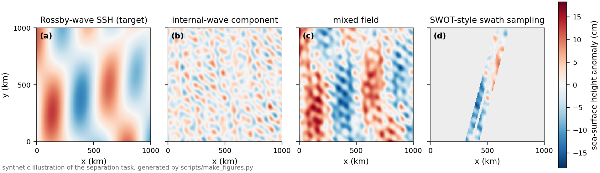
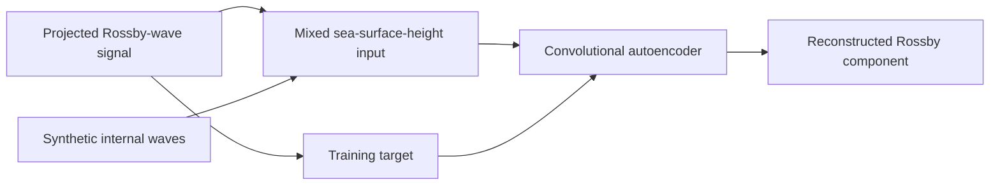

# Deep Learning for Source Separation in SWOT Satellite Altimetry

[](https://github.com/liangyuchen-research/ocean-satellite-wave-separation/actions/workflows/checks.yml)

Denoising-autoencoder experiments that recover Rossby-wave structure from sea-surface-height fields contaminated by synthetic internal waves, as sampled along SWOT satellite swaths. The work combines physical wave modelling (Rossby-wave modes fitted to altimetry anomalies), projection onto the SWOT ground track, and convolutional reconstruction in flattened and spatial representations.

Carried out during the International Summer Research Program at Scripps Institution of Oceanography, UC San Diego, with Prof. Sarah Gille (July–August 2024).

**Tools:** TensorFlow/Keras, NumPy, SciPy, xarray, NetCDF, Matplotlib.

## The problem



*The separation task, illustrated with synthetic fields generated by `scripts/make_figures.py` (not research data): the long-wavelength Rossby signal (a) is buried under shorter internal waves (b) in the observed field (c), and the satellite only sees the two-sided swath (d). The autoencoder is trained to map (d) back to (a) at the sampled points.*



The derived datasets contain **117 training and 59 validation sets**, each with **277 swath points over 20 sampled days**. Eight maintained notebooks compare input representations (flattened swath vectors vs. spatial arrays), dataset sizes, decoder types and output activations; the main experiment is `notebooks/modeling/05_train_swath_autoencoder.ipynb`. The historical files call the validation split `testing`; it was monitored during training and is not an independent final test.

## Run

Python 3.12 in a separate environment:

```bash
python -m pip install -r requirements-models.txt
python scripts/check_repository.py                     # notebook schema, guards, numerical smoke test
python -m unittest discover -s tests -v                 # masking, mode dimensions, regularized inversion
python scripts/check_model_notebooks.py --notebook 05_train_swath_autoencoder   # full notebook on small synthetic data, 1 epoch
python scripts/make_figures.py                          # regenerates the illustration above
```

The notebook check runs the complete main notebook — one training epoch, model export and reloaded inference — on small synthetic inputs and needs no research data. To use the original derived inputs, restore the two canonical NetCDF files from an authorized archive and open the notebook:

```bash
python scripts/restore_artifacts.py --source /path/to/source-archive --only canonical
jupyter lab notebooks/modeling/05_train_swath_autoencoder.ipynb
```

Review the 30,000-epoch configuration and set `ALLOW_TRAINING = True` before training. `OCEAN_DATA_DIR` and `OCEAN_ARTIFACT_DIR` select the input and output directories; existing outputs are never overwritten.

## Repository contents

| Directory | Contents |
| --- | --- |
| `notebooks/modeling/` | Main swath reconstruction experiment |
| `notebooks/experiments/` | Seven maintained spatial, flattened and dense-decoder variants |
| `src/` | Rossby-wave numerical routines (skill matrix, swath projection, regularized inversion) and portable file access |
| `scripts/` | Notebook checks, checksum-verified data restoration, figure generation |
| `tests/` | Numerical regressions for masking, mode dimensions and inversion |
| `data/` | Input descriptions and artifact checksums |
| `docs/` | [Reproduction](docs/reproduction.md), [source provenance](docs/notebook-provenance.json), [curation notes](docs/curation.md), [limitations](docs/limitations.md) |

## Evaluation and provenance

The notebooks keep their original architectures and validation protocol. Because preprocessing windows overlap and the validation split was used during training, a separate temporal or geographic hold-out would be needed before making generalization claims, and no accuracy ranking is asserted from the historical logs. All eight maintained notebooks execute end to end on synthetic inputs with TensorFlow 2.20 / Keras 3.15 (`constraints-tested.txt`). The upstream preprocessing and two unresolved historical variants are preserved in a separate archive rather than presented as runnable examples; see the [limitations](docs/limitations.md).

Satellite products and scientific helpers retain their original attribution and rights. Raw products, derived datasets and historical checkpoints are not redistributed here ([NOTICE.md](NOTICE.md)).
