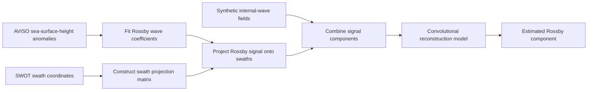

# Deep Learning for Source Separation in SWOT Satellite Altimetry

Deep learning experiments for separating Rossby-wave structure from synthetic internal-wave contamination in sea-surface-height data sampled along SWOT satellite swaths. The workflow combines physical wave modeling, spatial projection, and denoising autoencoder experiments, comparing input dimensions and representations for source separation.

Developed during the International Summer Research Program at Scripps Institution of Oceanography, UC San Diego, with Prof. Sarah Gille (July-August 2024).

**Technologies:** TensorFlow/Keras, NumPy, SciPy, xarray, NetCDF, Matplotlib.

## Approach



Model inputs combine Rossby and synthetic internal-wave signals; targets contain the Rossby component. The canonical derived datasets contain **117 training sets and 59 testing sets**, each with **277 swath points over 20 sampled days**.

| Directory | Contents |
| --- | --- |
| `notebooks/preprocessing/` | Eight notebooks for wave fitting, swath construction, synthesis, and projection |
| `notebooks/modeling/` | Main swath autoencoder experiment |
| `notebooks/experiments/` | Spatial, dense-decoder, tanh-decoder, and adversarial variants |
| `src/` | Rossby-wave numerical routines and portable data paths |
| `data/` | Dataset and checkpoint manifests with SHA-256 checksums |

## Run the model workflow

The datasets and checkpoints are not distributed in this repository. With access to the original data, restore `new2_ssh_training_data.nc` and `new2_ssh_testing_data.nc` using the [artifact manifest](data/artifact-manifest.json).

Create and activate a separate Python environment, then run:

```bash
python -m pip install -r requirements-models.txt
jupyter lab
```

Open [05_train_swath_autoencoder.ipynb](notebooks/modeling/05_train_swath_autoencoder.ipynb), review the input shapes and epoch count, and set `ALLOW_TRAINING = True` to train. Inputs are read from `data/`; generated results go to `artifacts/` and are protected against silent overwrite.

The archived checkpoints record Keras 2.6.0. The dependency list is a starting point for environment setup, not an exact historical lockfile. Training and checkpoint compatibility with current TensorFlow/Keras have not been verified.

## Reproduction and evaluation

The complete preprocessing route requires upstream files and the `internal_waves` module that are not included. See [reproduction instructions](docs/reproduction.md) for notebook order and input requirements.

The historical training code uses the arrays named `testing` for validation. Results from those arrays are therefore not an independent final test. The experiments also use overlapping windows and require a separate temporal or geographic holdout for generalization assessment. See [limitations](docs/limitations.md).

## Offline validation

```bash
python scripts/check_repository.py
```

The checker validates notebook schemas and Python syntax, tests path and overwrite protection, and runs a small regularized-inversion check. It does not execute training or the full physical preprocessing workflow.

## Attribution and data rights

Scientific helpers and satellite products retain their original attribution and rights. Per-file authorship and a project-wide license are not fully documented in the source collection. Raw satellite products, derived datasets, and checkpoints are not redistributed here. See [NOTICE.md](NOTICE.md) and [source notes](docs/curation.md).
